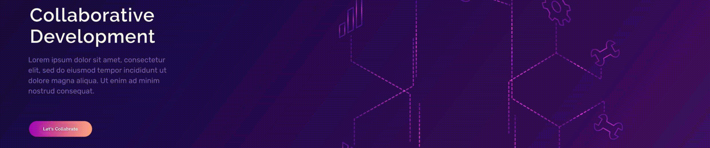

<h2 align="left">H!!!  !'m vikas vishwakarma 
</h2>

  

<table>
    <tbody border="0" cellspacing="0" cellpadding="0">
        <tr  style="width:70%">
           <td rowspan=6>
              
## Abstract
I'm an web developer by specialization and A passionate frontend & backend developer from India at heart.
- I'm a student at [Govt Polytechnic College Harusd ](https://gpch.in/).
- I enjoy playing volleyball and Badminton , and reading books. 
- I regularly write articles on [i-coder-hevan](https://vikasvishwakarma018.github.io/iCoder--hevan-programer/)
- How to reach me visv9199@gmail.com
- Let's Connect [LinkedIn Profile](https://www.linkedin.com/in/vikas-vishwakarma-3188a9334/)
          </td>
        </tr>
        <tr>
            <td width="38%"> </td>
        </tr>
    </tbody>
</table>
    

    
<h3 align="left">Languages and Tools:</h3>  
    

##  </a>      <a href="https://nestjs.com/" target="_blank" rel="noreferrer">   
  
 

 

## Here are some ideas to get you started:

- 🌱 I’m currently learning   
   
  

- 👯 I’m looking to collaborate on started for  this journey "Enjoy the collaborate"   
  
- 💬 Ask me about ..Full Stack web Developer   

- 📫 How to reach me: visv9199@gmial.com   

- ⚡ Fun fact: Enjoy This Web Devloper journey    

#

## Links
  

  
 <!--- --->
<!---  --->

  
   

#

#

<!--

 -->

<!--############################################  ##############################-->
